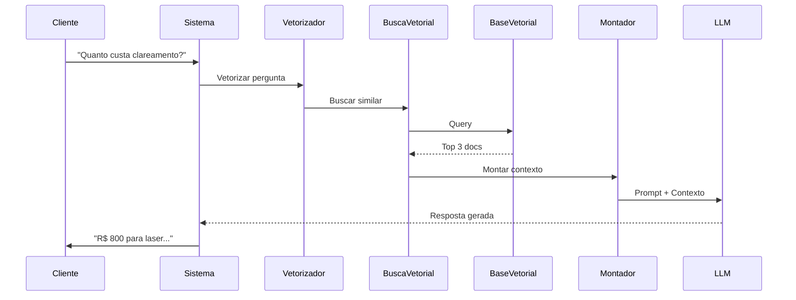

## Introdução

A Base de Conhecimento é o "cérebro informacional" do seu agente. Entender como ela funciona tecnicamente permite otimizar significativamente a qualidade das respostas.

<Info>
  Para o guia prático de uso, veja [Adicionar Conhecimento](/pt/guias/adicionar-conhecimento). Esta página foca nos conceitos técnicos.
</Info>

## Vetorização (Embeddings)

### O que são Vetores?

Vetores (ou embeddings) são **representações numéricas de texto** que capturam significado semântico.

```
Texto: "Clareamento dental"
Vetor: [0.23, -0.15, 0.87, 0.42, ..., -0.31]
        ↑ 1536 dimensões (GPT-3)
```

**Por que vetorizar?**
- Computadores entendem números, não texto
- Permite cálculo de similaridade semântica
- Busca extremamente rápida
- Funciona em qualquer idioma

### Como Funciona a Busca

<Steps>
  <Step title="Documento é Vetorizado">
    Cada documento na base vira vetor:
    ```
    Doc1: "Clareamento a laser custa R$ 800"
    → [0.23, -0.15, 0.87, ...]
    ```
  </Step>
  
  <Step title="Pergunta é Vetorizada">
    Cliente pergunta:
    ```
    "Quanto custa clarear dente?"
    → [0.24, -0.14, 0.86, ...]
    ```
  </Step>
  
  <Step title="Similaridade é Calculada">
    Distância entre vetores (cosine similarity):
    ```
    similaridade(pergunta, doc1) = 0.95 (muito similar!)
    ```
  </Step>
  
  <Step title="Top K Retornados">
    Os 3-5 documentos mais similares são retornados
  </Step>
</Steps>

### Chunking (Divisão em Pedaços)

Documentos grandes são divididos em chunks:

```
Documento grande (5000 palavras)
↓
Chunk 1 (500 palavras)
Chunk 2 (500 palavras)
...
Chunk 10 (500 palavras)
```

**Por quê?**
- LLMs têm limite de contexto
- Chunks menores = busca mais precisa
- Melhor relevância

**Estratégias:**
- Por parágrafos
- Por seções
- Por tamanho fixo
- Por tópicos

## RAG (Retrieval Augmented Generation)

RAG combina busca (Retrieval) com geração (Generation).

### Fluxo Completo



### Vantagens do RAG

<CardGroup cols={2}>
  <Card title="Informação Atualizada" icon="rotate">
    Atualiza base → resposta muda imediatamente
  </Card>
  <Card title="Sem Retreinamento" icon="bolt">
    Não precisa retreinar modelo
  </Card>
  <Card title="Transparência" icon="eye">
    Saiba de onde veio a informação
  </Card>
  <Card title="Menos Alucinação" icon="shield-check">
    Respostas baseadas em fatos reais
  </Card>
</CardGroup>

## Otimização da Base

### Estruturação de Documentos

<Tabs>
  <Tab title="✅ Boas Práticas">
    **Estrutura Clara:**
    ```markdown
    # Clareamento Dental
    
    ## Tipos Oferecidos
    - Laser: R$ 800
    - Caseiro: R$ 450
    
    ## Duração
    - Laser: 1 sessão de 40min
    - Caseiro: 3 semanas
    
    ## Indicações
    - Dentes amarelados
    - Manchas de café/cigarro
    ```
    
    **Por quê funciona bem:**
    - Hierarquia clara
    - Informações organizadas
    - Fácil de chunkar
    - Contexto evidente
  </Tab>
  
  <Tab title="❌ Evite">
    **Texto Contínuo Sem Estrutura:**
    ```
    O clareamento pode ser a laser ou caseiro o laser
    custa oitocentos reais e é em uma sessão já o caseiro
    são quatrocentos e cinquenta e demora três semanas...
    ```
    
    **Problemas:**
    - Difícil de extrair informação específica
    - Chunks misturam tópicos
    - Menor precisão na busca
  </Tab>
</Tabs>

### Metadados

Adicione metadados aos documentos:

```json
{
  "conteudo": "Clareamento a laser custa R$ 800...",
  "metadados": {
    "categoria": "precos",
    "subcategoria": "clareamento",
    "atualizado_em": "2025-01-01",
    "valido_ate": "2025-12-31",
    "prioridade": "alta"
  }
}
```

**Uso dos metadados:**
- Filtrar busca por categoria
- Priorizar documentos atualizados
- Invalidar documentos vencidos
- Dar peso diferente por prioridade

## Qualidade dos Dados

### Checklist de Qualidade

<Check>
  **Informação Completa**
  - Todas as perguntas frequentes respondidas?
  - Informações de contato presentes?
  - Preços atualizados?
</Check>

<Check>
  **Informação Consistente**
  - Sem contradições entre documentos?
  - Mesma informação expressa igual?
  - Terminologia padronizada?
</Check>

<Check>
  **Informação Relevante**
  - Focada no que clientes perguntam?
  - Sem informações internas desnecessárias?
  - Nível de detalhe adequado?
</Check>

### Testes de Qualidade

Faça testes regulares:

**1. Perguntas de Teste:**
```
- "Quanto custa X?"
- "Como funciona Y?"
- "Vocês fazem Z?"
- "Qual o horário?"
- "Onde fica?"
```

**2. Avalie:**
- ✅ Resposta está correta?
- ✅ Usou informação da base?
- ✅ Tom está adequado?
- ❌ Inventou informação?
- ❌ Não achou resposta?

## Técnicas Avançadas

### Hybrid Search

Combina busca vetorial + busca por palavras-chave:

```
Pergunta: "clareamento dental preço"

Busca Vetorial: Documentos semanticamente similares
Busca Keyword: Documentos contendo exatamente "clareamento", "dental", "preço"

Resultado Final: Combinação inteligente dos dois
```

**Vantagens:**
- Melhor para termos técnicos específicos
- Captura sinônimos (vetorial)
- Captura termos exatos (keyword)

### Reranking

Após busca inicial, reordena resultados:

<Steps>
  <Step title="Busca Inicial">
    Retorna Top 10 candidatos
  </Step>
  
  <Step title="Reranking">
    Modelo especializado reavalia relevância
  </Step>
  
  <Step title="Top Final">
    Retorna Top 3 mais relevantes de verdade
  </Step>
</Steps>

**Melhora precisão em ~15-20%**

### Query Expansion

Expande a pergunta para melhorar busca:

```
Pergunta original: "valor clareamento"

Expandida:
- "valor clareamento"
- "preço clareamento dental"
- "quanto custa clarear dente"
- "custo procedimento clareamento"

Busca usando todas as variações
```

## Monitoramento e Métricas

### KPIs Importantes

<CardGroup cols={2}>
  <Card title="Hit Rate" icon="bullseye">
    % de perguntas que encontraram informação relevante
    
    **Meta:** > 90%
  </Card>
  
  <Card title="Latência" icon="clock">
    Tempo de busca na base
    
    **Meta:** < 200ms
  </Card>
  
  <Card title="Recall@K" icon="list">
    % de documentos relevantes nos Top K
    
    **Meta:** > 85% no Top 3
  </Card>
  
  <Card title="User Satisfaction" icon="star">
    Satisfação do cliente com resposta
    
    **Meta:** > 4.5/5
  </Card>
</CardGroup>

### Análise de Gaps

Identifique o que falta na base:

**Perguntas sem resposta satisfatória:**
1. Agrupe perguntas similares
2. Identifique padrões
3. Crie documento para cobrir gap
4. Adicione à base
5. Teste novamente

## Manutenção Contínua

<Steps>
  <Step title="Revisão Mensal">
    - Documentos desatualizados?
    - Informações mudaram?
    - Novos produtos/serviços?
  </Step>
  
  <Step title="Análise de Conversas">
    - Quais perguntas agente não soube?
    - Onde inventou informação?
    - Feedback negativo dos clientes?
  </Step>
  
  <Step title="Atualização">
    - Remover obsoleto
    - Adicionar novo
    - Corrigir erros
    - Melhorar estrutura
  </Step>
  
  <Step title="Validação">
    - Testar perguntas problemáticas
    - Verificar melhoria
    - Documentar mudanças
  </Step>
</Steps>

## Limitações Técnicas

<Warning>
  **Tamanho de Contexto**
  
  LLMs têm limite de tokens:
  - GPT-4: 8k-32k tokens
  - Claude 3: 200k tokens
  
  Solução: Chunking e seleção dos melhores chunks
</Warning>

<Warning>
  **Custo de Vetorização**
  
  Vetorizar é pago por token:
  - ~$0.0001 por 1k tokens
  
  Otimize removendo duplicações e conteúdo irrelevante
</Warning>

## Comparação de Abordagens

<Tabs>
  <Tab title="Sem RAG (Apenas LLM)">
    **Como funciona:**
    - LLM responde baseado apenas em treinamento
    
    **Problemas:**
    - ❌ Informações desatualizadas
    - ❌ Não conhece seu negócio
    - ❌ Alucina frequentemente
    - ❌ Não tem dados específicos
  </Tab>
  
  <Tab title="Com RAG (Integrabot)">
    **Como funciona:**
    - LLM responde baseado em sua base de conhecimento
    
    **Vantagens:**
    - ✅ Informações sempre atualizadas
    - ✅ Conhece seu negócio profundamente
    - ✅ Respostas baseadas em fatos
    - ✅ Dados específicos e precisos
  </Tab>
  
  <Tab title="Fine-tuning (Alternativa)">
    **Como funciona:**
    - Retreinar modelo com seus dados
    
    **Desvantagens:**
    - ❌ Caro ($$ por treinamento)
    - ❌ Lento (horas/dias)
    - ❌ Difícil atualizar
    - ❌ Pode esquecer conhecimento geral
    
    **RAG é melhor para 90% dos casos**
  </Tab>
</Tabs>

## Recursos Adicionais

<CardGroup cols={2}>
  <Card
    title="Guia Prático"
    icon="book"
    href="/pt/guias/adicionar-conhecimento"
  >
    Como adicionar e gerenciar conhecimento
  </Card>
  <Card
    title="Como Funciona IA"
    icon="brain"
    href="/pt/conceitos/como-funciona-ia"
  >
    Visão geral da arquitetura de IA
  </Card>
  <Card
    title="API Reference"
    icon="code"
  >
    Documentação técnica da API (em breve)
  </Card>
  <Card
    title="Suporte"
    icon="headset"
  >
    hello@integrabot.ai
  </Card>
</CardGroup>

