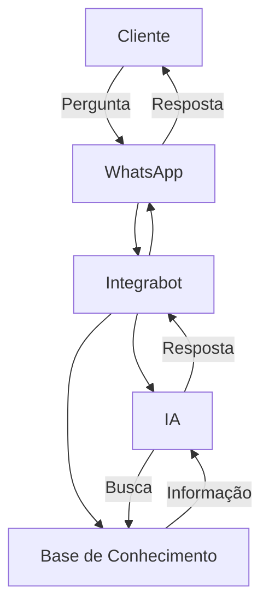

O agente usa IA para entender perguntas e buscar respostas na sua base de conhecimento.

## Arquitetura

## Como Responde

1. Cliente faz pergunta no WhatsApp
2. Pergunta é enviada para a IA
3. IA busca informação relevante na base de conhecimento
4. IA formula resposta usando o conhecimento
5. Resposta é enviada ao cliente

<Info>
  A IA sempre usa informações da sua base de conhecimento, não inventa dados
</Info>

## Busca Semântica

O agente busca por **significado**, não palavras exatas.

Se cliente perguntar "qual o valor", o agente encontra "preço" na base.

<Card title="Base de Conhecimento" icon="book" href="/pt/guias/adicionar-conhecimento">
  Adicione informações
</Card>
