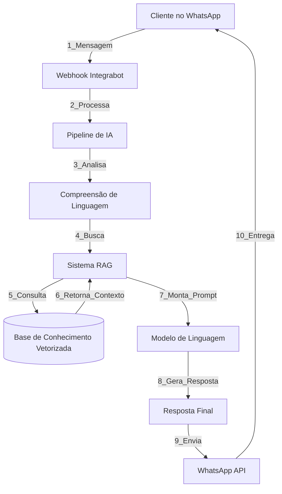
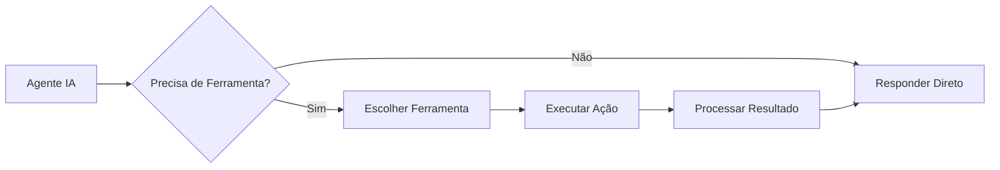

## Visão Geral

O agente de IA do Integrabot utiliza tecnologias avançadas de **Processamento de Linguagem Natural (NLP)** e **Inteligência Artificial Generativa** para entender e responder seus clientes de forma natural e contextual.

<Info>
  O Integrabot utiliza modelos de linguagem de última geração, similar ao ChatGPT, mas especializado e treinado com as informações do seu negócio.
</Info>

## Arquitetura do Sistema



## Etapas do Processamento

### 1. Recepção da Mensagem

Quando um cliente envia uma mensagem:

<Steps>
  <Step title="Cliente Envia">
    Mensagem via WhatsApp
  </Step>
  
  <Step title="WhatsApp API">
    Recebe e encaminha via webhook
  </Step>
  
  <Step title="Integrabot Captura">
    Sistema recebe instantaneamente
  </Step>
  
  <Step title="Fila de Processamento">
    Mensagem entra na fila para processamento
  </Step>
</Steps>

<Tip>
  **Tempo médio:** < 1 segundo entre envio e início do processamento
</Tip>

### 2. Análise de Intenção (NLU)

O sistema analisa a mensagem para entender **o que o cliente quer**.

<Accordion title="Técnicas Utilizadas">
  **Análise de Sentimento:**
  - Positivo 😊
  - Neutro 😐
  - Negativo 😞
  
  **Classificação de Intenção:**
  - Pergunta sobre produto/serviço
  - Solicitação de agendamento
  - Reclamação
  - Pedido de informação
  - Saudação/despedida
  
  **Extração de Entidades:**
  - Nomes de produtos
  - Datas
  - Valores
  - Localizações
  - Preferências
</Accordion>

**Exemplo:**

```
Cliente: "Gostaria de agendar uma consulta para terça que vem"

Análise:
- Intenção: Agendamento
- Sentimento: Positivo
- Entidades: 
  - Ação: "agendar"
  - Tipo: "consulta"
  - Data: "terça próxima" → 2025-01-14
```

### 3. Busca de Conhecimento (RAG)

**RAG** significa **Retrieval Augmented Generation** (Geração Aumentada por Recuperação).

<Tabs>
  <Tab title="O que é RAG?">
    RAG é uma técnica que combina:
    
    1. **Recuperação** de informações relevantes da base de conhecimento
    2. **Geração** de resposta usando essas informações como contexto
    
    **Por que usar RAG?**
    - ✅ Respostas baseadas em fatos reais
    - ✅ Informações sempre atualizadas
    - ✅ Reduz "alucinações" da IA
    - ✅ Mantém consistência
  </Tab>
  
  <Tab title="Como Funciona?">
    **Processo:**
    
    <Steps>
      <Step title="Pergunta é Vetorizada">
        Mensagem é convertida em vetor matemático (embedding)
      </Step>
      
      <Step title="Busca por Similaridade">
        Sistema busca vetores similares na base de conhecimento
      </Step>
      
      <Step title="Top K Resultados">
        Retorna os 3-5 documentos mais relevantes
      </Step>
      
      <Step title="Contexto é Montado">
        Documentos são organizados como contexto para o LLM
      </Step>
    </Steps>
    
    **Exemplo:**
    
    ```
    Pergunta: "Quanto custa o clareamento?"
    
    Vetor da pergunta: [0.23, -0.15, 0.87, ...]
    
    Busca na base encontra:
    1. Documento "Preços de Clareamento" (similaridade: 0.92)
    2. Documento "Tipos de Clareamento" (similaridade: 0.85)
    3. Documento "FAQ Clareamento" (similaridade: 0.78)
    
    Esses documentos são enviados como contexto para o LLM
    ```
  </Step>
  
  <Tab title="Vetorização">
    ### O que são Vetores (Embeddings)?
    
    Vetores são representações matemáticas de texto que capturam **significado semântico**.
    
    **Exemplo simplificado:**
    
    ```
    "cachorro" → [0.8, 0.2, 0.1, 0.9, ...]
    "cão"      → [0.8, 0.2, 0.1, 0.9, ...] (similar!)
    "gato"     → [0.7, 0.3, 0.2, 0.8, ...] (próximo)
    "carro"    → [0.1, 0.9, 0.8, 0.2, ...] (distante)
    ```
    
    Textos com significado similar têm vetores próximos no espaço matemático.
    
    **No Integrabot:**
    - Cada documento da base é vetorizado
    - Mensagens do cliente são vetorizadas
    - Busca por similaridade é extremamente rápida
    - Funciona em qualquer idioma
  </Tab>
</Tabs>

### 4. Geração de Resposta (LLM)

Com contexto e intenção identificados, o **Modelo de Linguagem (LLM)** gera a resposta.

<AccordionGroup>
  <Accordion title="O que é LLM?" icon="brain">
    **Large Language Model** (Modelo de Linguagem Grande)
    
    É uma rede neural treinada em bilhões de textos que:
    - Entende linguagem natural
    - Gera texto coerente e contextual
    - Mantém conversa fluente
    - Adapta tom e estilo
    
    **Modelos que usamos:**
    - GPT-4 (OpenAI) - padrão
    - Claude (Anthropic) - opcional
    - Llama 3 (Meta) - opcional
  </Accordion>
  
  <Accordion title="Como LLM Usa Contexto?" icon="puzzle">
    O LLM recebe um "prompt" estruturado:
    
    ```
    SISTEMA:
    Você é um assistente virtual da Clínica Odontológica XYZ.
    Seja cordial, profissional e empático.
    
    INSTRUÇÕES:
    - Sempre pergunte o nome do paciente
    - Ofereça agendamento de avaliação gratuita
    - Não diagnostique problemas médicos
    
    CONHECIMENTO RELEVANTE:
    [Documento 1: Preços de Clareamento]
    Clareamento a Laser: R$ 800
    Clareamento Caseiro: R$ 450
    
    [Documento 2: Procedimentos]
    Avaliação inicial gratuita...
    
    CONVERSA ANTERIOR:
    Cliente: Olá
    Você: Olá! Seja bem-vindo à Clínica XYZ! Qual é seu nome?
    Cliente: João
    Você: Prazer, João! Como posso te ajudar hoje?
    
    MENSAGEM ATUAL:
    Cliente: Quanto custa o clareamento?
    
    RESPONDA DE FORMA NATURAL E ÚTIL:
    ```
    
    LLM processa tudo isso e gera resposta apropriada.
  </Accordion>
  
  <Accordion title="Parâmetros de Geração" icon="sliders">
    ### Temperatura
    
    Controla criatividade vs consistência:
    
    - **0.1:** Muito consistente, pouca variação
    - **0.3:** Equilibrado (padrão)
    - **0.7:** Mais criativo e variado
    
    ### Top P
    
    Controla diversidade de vocabulário (padrão: 0.9)
    
    ### Max Tokens
    
    Tamanho máximo da resposta (padrão: 500 tokens ≈ 375 palavras)
    
    ### Presence Penalty
    
    Reduz repetição (padrão: 0.6)
  </Accordion>
</AccordionGroup>

### 5. Pós-processamento

Antes de enviar, a resposta passa por validações:

<Check>
  **Verificações:**
  - ✅ Resposta é relevante à pergunta?
  - ✅ Não contém informações sensíveis?
  - ✅ Está dentro do limite de caracteres do WhatsApp?
  - ✅ Tom está adequado?
  - ✅ Contém call-to-action apropriado?
</Check>

**Exemplo de ajuste:**

```
Resposta original (muito longa):
"O clareamento dental é um procedimento odontológico estético que tem como objetivo clarear os dentes, removendo manchas e deixando-os mais brancos. Oferecemos duas opções: clareamento a laser, que é feito em consultório e custa R$ 800, com resultado imediato, e o clareamento caseiro, que custa R$ 450 e você faz em casa com moldeiras durante 3 semanas..."

Resposta otimizada:
"Oferecemos duas opções de clareamento:

🦷 Laser (consultório): R$ 800 - resultado imediato
🏠 Caseiro: R$ 450 - 3 semanas de tratamento

A primeira consulta de avaliação é gratuita! Posso agendar para você?"
```

### 6. Envio e Acompanhamento

<Steps>
  <Step title="Envio via API">
    Resposta é enviada pela WhatsApp Business API
  </Step>
  
  <Step title="Confirmação de Entrega">
    Sistema recebe confirmação de entrega
  </Step>
  
  <Step title="Leitura">
    Quando cliente lê, status é atualizado
  </Step>
  
  <Step title="Próxima Interação">
    Conversa permanece em contexto para continuidade
  </Step>
</Steps>

## Memória e Contexto

O agente mantém **memória de curto prazo** da conversa:

<Tabs>
  <Tab title="Memória da Conversa">
    **Mantém:**
    - Últimas 10-15 mensagens
    - Nome do cliente
    - Preferências mencionadas
    - Estado da conversa
    
    **Permite:**
    - Respostas contextuais
    - Evitar perguntas repetidas
    - Continuidade natural
    
    **Exemplo:**
    ```
    Cliente: Qual o horário de vocês?
    Agente: Funcionamos de segunda a sexta, 9h às 18h.
    
    Cliente: E no sábado?
    Agente: Aos sábados abrimos das 9h às 13h.
    
    Cliente: Posso ir amanhã?
    Agente: Sim! Amanhã é [dia]. Prefere manhã ou tarde?
    ```
    (Agente lembra contexto de horários e conecta informações)
  </Tab>
  
  <Tab title="Memória de Longo Prazo">
    **Armazenado no CRM:**
    - Histórico completo de conversas
    - Preferências do cliente
    - Compras anteriores
    - Tags e classificações
    
    **Recuperado quando necessário:**
    ```
    Cliente retorna após 1 mês:
    "Olá novamente!"
    
    Agente reconhece:
    "Olá João! Que bom te ver de novo! 
    Como foi a consulta de ortodontia que agendamos mês passado?"
    ```
  </Tab>
</Tabs>

## Ferramentas e Ações

Além de conversar, o agente pode **executar ações**:



**Exemplo com ferramenta:**

```
Cliente: "Tem essa camisa em estoque?"

Agente (internamente):
1. Identifica: Preciso consultar estoque
2. Chama ferramenta: consultar_estoque("camisa-azul-M")
3. Recebe: { disponivel: true, quantidade: 5 }
4. Gera resposta: "Sim! Temos 5 unidades disponíveis da camisa azul M."
```

Veja mais em [Guia de Ferramentas](/pt/guias/ferramentas-ia).

## Limitações da IA

<Warning>
  É importante entender o que a IA **não pode** fazer:
</Warning>

<AccordionGroup>
  <Accordion title="Não tem Acesso a Informações Externas" icon="globe">
    A IA só conhece o que está na base de conhecimento.
    
    **Não pode:**
    - Acessar websites em tempo real
    - Buscar no Google
    - Ver emails ou sistemas externos
    
    **Solução:** Use ferramentas customizadas para integrar sistemas.
  </Accordion>
  
  <Accordion title="Pode 'Alucinar'" icon="sparkles">
    Às vezes inventa informações quando não sabe.
    
    **Como minimizar:**
    - Base de conhecimento completa
    - Instruções claras para "não sabe"
    - Monitoramento regular
    - Revisão de conversas
  </Accordion>
  
  <Accordion title="Não Entende Nuances Complexas" icon="question">
    Sarcasmo, ironias e contextos muito específicos podem confundir.
    
    **Como lidar:**
    - Configure transferência para humano em casos complexos
    - Treine com exemplos específicos
    - Monitore e ajuste
  </Accordion>
  
  <Accordion title="Requer Conhecimento Atualizado" icon="clock">
    Informações desatualizadas geram respostas erradas.
    
    **Solução:**
    - Atualize base de conhecimento regularmente
    - Configure alertas para revisar periodicamente
    - Use ferramentas para dados dinâmicos
  </Accordion>
</AccordionGroup>

## Segurança e Privacidade

<CardGroup cols={2}>
  <Card title="Criptografia" icon="lock">
    Todas as mensagens são criptografadas end-to-end pelo WhatsApp
  </Card>
  <Card title="LGPD Compliant" icon="shield-check">
    Sistema em conformidade com LGPD brasileira
  </Card>
  <Card title="Dados Isolados" icon="database">
    Cada workspace tem dados completamente isolados
  </Card>
  <Card title="Não Treina com Seus Dados" icon="ban">
    Suas conversas não são usadas para treinar modelos públicos
  </Card>
</CardGroup>

## Melhorando a Performance

<Steps>
  <Step title="Base de Conhecimento Completa">
    Quanto mais informação relevante, melhores as respostas
  </Step>
  
  <Step title="Instruções Claras">
    Defina bem o comportamento esperado em [Meu Agente](/pt/guias/configurar-agente)
  </Step>
  
  <Step title="Exemplos de Conversas">
    Inclua exemplos na base de conhecimento de como responder certas situações
  </Step>
  
  <Step title="Monitore e Ajuste">
    Revise conversas regularmente e ajuste configurações
  </Step>
  
  <Step title="Use Ferramentas">
    Para dados dinâmicos, use [ferramentas customizadas](/pt/guias/ferramentas-ia)
  </Step>
</Steps>

## Tecnologias Utilizadas

<Accordion title="Stack Tecnológica">
  **Processamento de Linguagem:**
  - OpenAI GPT-4
  - Anthropic Claude 3
  - Meta Llama 3
  
  **Vetorização:**
  - OpenAI text-embedding-3
  - Sentence Transformers
  
  **Banco Vetorial:**
  - Pinecone
  - Qdrant
  
  **Infraestrutura:**
  - AWS Lambda (serverless)
  - PostgreSQL (dados estruturados)
  - Redis (cache e filas)
  
  **APIs:**
  - WhatsApp Business API
  - Evolution API (opcional)
</Accordion>

## Comparação: Com vs Sem IA

<Tabs>
  <Tab title="Sem IA (Manual)">
    **Limitações:**
    - ⏰ Apenas em horário comercial
    - 👤 Um atendente = uma conversa
    - 😴 Qualidade varia com cansaço
    - 📈 Não escala facilmente
    - 💰 Custo por atendente
    - ⏱️ Tempo de resposta variável
  </Tab>
  
  <Tab title="Com IA (Integrabot)">
    **Benefícios:**
    - 🌙 24/7 sem pausa
    - ⚡ Milhares de conversas simultâneas
    - 🎯 Qualidade consistente
    - 📊 Escala infinitamente
    - 💸 Custo fixo
    - ⚡ Resposta instantânea
    - 🧠 Aprende com feedback
  </Tab>
</Tabs>

## Próximos Passos

<CardGroup cols={2}>
  <Card
    title="Configurar Agente"
    icon="robot"
    href="/pt/guias/configurar-agente"
  >
    Otimize as configurações do seu agente
  </Card>
  <Card
    title="Base de Conhecimento"
    icon="book"
    href="/pt/conceitos/base-conhecimento"
  >
    Entenda mais sobre vetorização e RAG
  </Card>
  <Card
    title="Ferramentas IA"
    icon="wrench"
    href="/pt/guias/ferramentas-ia"
  >
    Expanda capacidades com ferramentas
  </Card>
  <Card
    title="Integrações"
    icon="plug"
    href="/pt/conceitos/integracoes"
  >
    Conecte com outros sistemas
  </Card>
</CardGroup>

