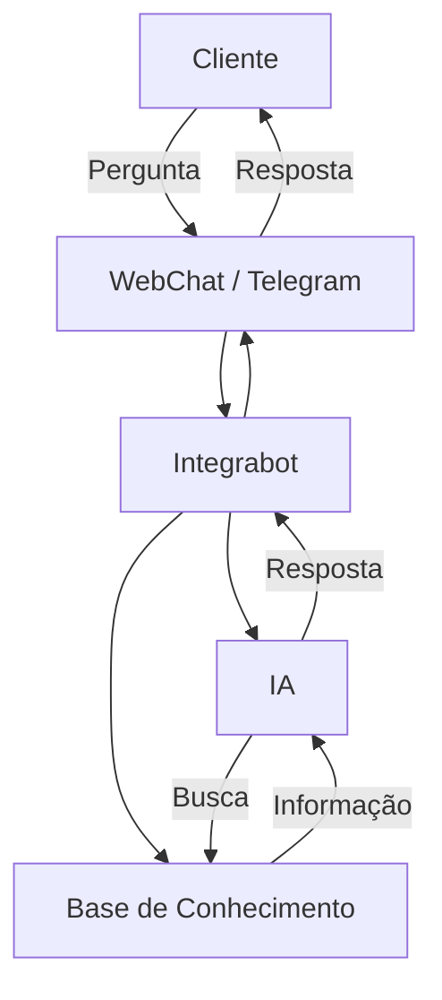

O Assistente usa IA para entender perguntas e buscar respostas na sua base de conhecimento.

## Arquitetura

```mermaid
graph TD
    User[Cliente] -- Pergunta --> Canal[WebChat / Telegram]
    Canal --> Integrabot[Integrabot]
    Integrabot --> LLM[IA]
    Integrabot --> KB[Base de Conhecimento]
    LLM -- Busca --> KB
    KB -- Informação --> LLM
    LLM -- Resposta --> Integrabot
    Integrabot --> Canal
    Canal -- Resposta --> User
```

## Como Responde

1. Cliente faz pergunta no WebChat ou Telegram
2. Pergunta é enviada para a IA
3. IA busca informação relevante na base de conhecimento
4. IA formula resposta usando o conhecimento
5. Resposta é enviada ao cliente

<Info>
  A IA sempre usa informações da sua base de conhecimento, não inventa dados.
</Info>

## Busca Semântica

O Assistente busca por **significado**, não por palavras exatas. Se o cliente perguntar "qual o valor", o Assistente encontra "preço" na base.

<Card title="Base de Conhecimento" icon="book" href="/pt/guias/adicionar-conhecimento">
  Adicione informações
</Card>
