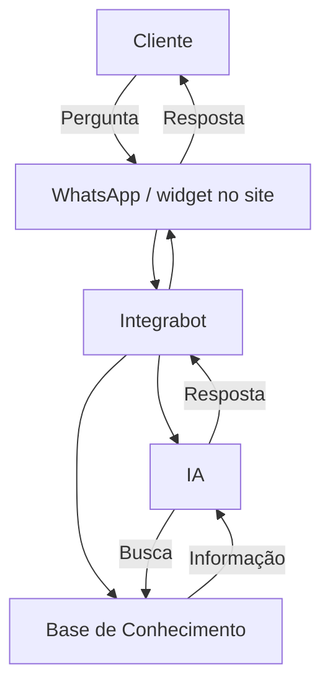

O Agente de IA entende a pergunta do cliente, busca a resposta na base de conhecimento do seu negócio e confere a resposta antes de enviar.

## Arquitetura

```mermaid
graph TD
    User[Cliente] -- Pergunta --> Canal[WhatsApp / widget no site]
    Canal --> Integrabot[Integrabot]
    Integrabot --> LLM[IA]
    Integrabot --> KB[Base de Conhecimento]
    LLM -- Busca --> KB
    KB -- Informação --> LLM
    LLM -- Resposta --> Integrabot
    Integrabot --> Canal
    Canal -- Resposta --> User
```

## Como Responde

1. Cliente faz uma pergunta no WhatsApp ou no widget do site
2. Pergunta é enviada para a IA
3. IA busca informação relevante na base de conhecimento
4. IA formula resposta usando o conhecimento
5. Resposta é enviada ao cliente

<Info>
  O Agente é orientado a responder com a sua base de conhecimento e não inventar dados. Sem a informação, ele diz que não tem e oferece o próximo passo, ou transfere para a equipe.
</Info>

## Busca Semântica

O Agente busca por **significado**, não por palavras exatas. Se o cliente perguntar "qual o valor", o Agente encontra "preço" na base.

<Card title="Base de Conhecimento" icon="book" href="/pt/guias/adicionar-conhecimento">
  Adicione informações
</Card>
