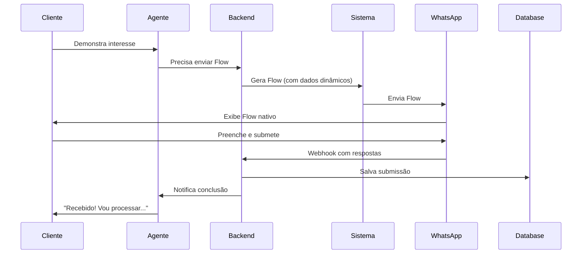

## O que são WhatsApp Flows?

WhatsApp Flows são formulários interativos nativos do WhatsApp, lançados oficialmente pela Meta em 2023.

<Info>
  Para o guia prático, veja [Criar Flows](/pt/guias/criar-flows). Esta página foca em conceitos técnicos e limitações.
</Info>

## Anatomia de um Flow

```json
{
  "version": "3.0",
  "screens": [
    {
      "id": "SCREEN_1",
      "title": "Informações de Contato",
      "data": {},
      "layout": {
        "type": "SingleColumnLayout",
        "children": [
          {
            "type": "TextInput",
            "name": "nome",
            "label": "Seu nome completo",
            "required": true
          }
        ]
      }
    }
  ]
}
```

### Estrutura

<Tabs>
  <Tab title="Screens (Telas)">
    Flow pode ter múltiplas telas:
    
    ```
    Flow de Agendamento:
    - Tela 1: Dados pessoais
    - Tela 2: Escolha de serviço
    - Tela 3: Seleção de data
    - Tela 4: Confirmação
    ```
    
    **Navegação:**
    - Footer com botões Next/Back
    - Validação antes de avançar
    - Progresso visual
  </Tab>
  
  <Tab title="Components (Campos)">
    Tipos disponíveis:
    - TextInput
    - TextArea
    - RadioButtonsGroup
    - CheckboxGroup
    - Dropdown
    - DatePicker
    - OptIn
    - Image
    - EmbeddedLink
    
    Veja [Referência Completa](/pt/referencia/componentes-flows)
  </Tab>
  
  <Tab title="Data (Dados)">
    Dados podem fluir entre telas:
    
    ```json
    {
      "data": {
        "nome": "${form.nome}",
        "email": "${form.email}",
        "produtos_disponiveis": "${dynamic.produtos}"
      }
    }
    ```
    
    Permite contexto entre telas
  </Tab>
</Tabs>

## Limitações da API

<Warning>
  **Importante:** WhatsApp Flows têm limitações significativas.
</Warning>

### Campos Dinâmicos

**Problema:** Campos não podem ser gerados dinamicamente baseado em dados externos em tempo real.

**O que NÃO funciona:**
```json
// ❌ Não é possível fazer isso:
{
  "type": "RadioButtonsGroup",
  "data_items": "${api.horarios_disponiveis}" // Não suportado!
}
```

**Workaround do Integrabot:**
1. Cliente solicita agendamento
2. Sistema consulta horários disponíveis
3. **Gera Flow pré-preenchido** com horários
4. Envia Flow personalizado ao cliente

<Accordion title="Exemplo de Implementação">
  ```javascript
  // Backend (sua API)
  async function gerarFlowAgendamento(clienteId) {
    // 1. Consulta horários disponíveis
    const horarios = await buscarHorariosDisponiveis();
    
    // 2. Gera opções do RadioButton
    const opcoes = horarios.map(h => ({
      id: h.id,
      title: `${h.data} - ${h.hora}`
    }));
    
    // 3. Monta Flow com dados
    const flow = {
      screens: [{
        layout: {
          children: [{
            type: "RadioButtonsGroup",
            data_items: opcoes // Pré-gerado!
          }]
        }
      }]
    };
    
    // 4. Retorna Flow personalizado
    return flow;
  }
  ```
</Accordion>

### Outras Limitações

<AccordionGroup>
  <Accordion title="Sem Lógica Condicional Nativa" icon="code-branch">
    **Não pode:**
    - Mostrar campo B apenas se campo A = X
    - Pular telas baseado em resposta
    
    **Workaround:**
    - Múltiplos Flows para diferentes cenários
    - Lógica no backend antes de enviar
  </Accordion>
  
  <Accordion title="Sem Validação Customizada" icon="shield-check">
    **Validações disponíveis:**
    - Tipo (email, phone, number)
    - Obrigatório/opcional
    - Min/max length
    - Regex pattern (limitado)
    
    **Não disponível:**
    - Validação contra banco de dados
    - Lógicas complexas
    - Validações cross-field
    
    **Workaround:**
    - Valide após submissão
    - Retorne erro se inválido
    - Solicite correção
  </Accordion>
  
  <Accordion title="Limite de Telas" icon="list">
    **Máximo:** 10 telas por Flow
    
    **Limite de campos:** ~20-30 campos total
    
    **Workaround:**
    - Divida em múltiplos Flows
    - Priorize campos essenciais
  </Accordion>
  
  <Accordion title="Sem Upload de Arquivos" icon="upload">
    **Não pode:**
    - Cliente fazer upload de foto/documento no Flow
    
    **Workaround:**
    - Solicite foto por mensagem normal após Flow
    - Use campo de texto para links (Google Drive, etc)
  </Accordion>
</AccordionGroup>

## Melhores Práticas

<CardGroup cols={2}>
  <Card title="Mantenha Curto" icon="gauge">
    5-8 campos idealmente
    
    Taxa de conclusão cai drasticamente com +10 campos
  </Card>
  
  <Card title="Ordem Lógica" icon="list-ol">
    - Fácil → Difícil
    - Geral → Específico
    - Obrigatório → Opcional
  </Card>
  
  <Card title="Labels Claros" icon="text">
    "Qual é seu nome?" vs "Nome"
    
    Perguntas diretas convertem melhor
  </Card>
  
  <Card title="Placeholders Úteis" icon="info">
    Dê exemplos:
    - "exemplo@email.com"
    - "(11) 99999-9999"
    - "Rua X, 123, Bairro Y"
  </Card>
  
  <Card title="Progressive Disclosure" icon="eye">
    Mostre informação progressivamente
    
    Não sobrecarregue primeira tela
  </Card>
  
  <Card title="Teste em Device Real" icon="mobile">
    Sempre teste no celular antes de publicar
    
    Desktop preview não é suficiente
  </Card>
</CardGroup>

## Fluxo de Dados



## Webhook de Submissão

Quando cliente submete Flow, você recebe webhook:

```json
{
  "flow_token": "ABC123",
  "version": "3.0",
  "screen": "FINAL",
  "data": {
    "nome": "João Silva",
    "email": "joao@example.com",
    "servico": "consultoria",
    "orcamento": "5000-15000"
  },
  "timestamp": "2025-01-04T10:30:00Z"
}
```

**Processe:**
1. Valide dados
2. Salve no banco
3. Dispare ações (email, CRM, etc)
4. Responda cliente via agente

## Versionamento

Flows são versionados:

```
v1.0 → Lançamento inicial
v2.0 → Adicionou DatePicker
v3.0 → Atual (múltiplas telas)
```

<Tip>
  Use sempre a última versão para ter todos os recursos.
</Tip>

## Comparação com Alternativas

<Tabs>
  <Tab title="WhatsApp Flow">
    **Pros:**
    - ✅ Nativo no WhatsApp
    - ✅ UX familiar
    - ✅ Alta taxa de conclusão
    - ✅ Validação automática
    
    **Contras:**
    - ❌ Limitações de dinamismo
    - ❌ Sem upload de arquivo
    - ❌ Pouca customização visual
  </Tab>
  
  <Tab title="Perguntas Sequenciais">
    **Pros:**
    - ✅ Totalmente flexível
    - ✅ Pode fazer upload
    - ✅ Lógica condicional fácil
    
    **Contras:**
    - ❌ Taxa de abandono maior
    - ❌ Mais mensagens
    - ❌ Experiência menos fluida
  </Tab>
  
  <Tab title="Link Externo">
    **Pros:**
    - ✅ Customização total
    - ✅ Qualquer funcionalidade
    - ✅ Analytics completo
    
    **Contras:**
    - ❌ Cliente sai do WhatsApp
    - ❌ Muito maior abandono
    - ❌ Fricção no processo
  </Tab>
</Tabs>

**Recomendação:** Use WhatsApp Flows quando possível. Reserve alternativas para casos que realmente precisam.

## Recursos Avançados

### Flow Analytics

Acompanhe métricas:
- Taxa de abertura
- Taxa de conclusão
- Tempo médio de preenchimento
- Campos com mais abandono
- Devices/OS

### A/B Testing

Teste variações:
- Ordem de campos
- Labels diferentes
- Número de telas
- Placeholders

**Exemplo:**
- Versão A: 1 tela, 6 campos
- Versão B: 2 telas, 3 campos cada

Veja qual converte melhor.

## Documentação Oficial

<Card title="Meta for Developers" icon="book" href="https://developers.facebook.com/docs/whatsapp/flows">
  Documentação completa da Meta sobre WhatsApp Flows
</Card>

## Próximos Passos

<CardGroup cols={2}>
  <Card
    title="Criar seu Flow"
    icon="plus"
    href="/pt/guias/criar-flows"
  >
    Guia prático passo a passo
  </Card>
  <Card
    title="Componentes"
    icon="puzzle-piece"
    href="/pt/referencia/componentes-flows"
  >
    Referência completa de todos os componentes
  </Card>
  <Card
    title="Ferramentas IA"
    icon="wrench"
    href="/pt/guias/ferramentas-ia"
  >
    Para Flows dinâmicos via API
  </Card>
  <Card
    title="Exemplos"
    icon="code"
  >
    Repositório com exemplos práticos (em breve)
  </Card>
</CardGroup>

